# LDTS_<04><07> - <Bad Ice Cream>

## Game Description 

Bad Ice Cream é um jogo desafiante e divertido para 2 jogadores trabalharem em conjunto de modo a matar todos os inimigos e ganhar o jogo. Este jogo é baseado no famoso jogo Bad Ice Cream e é constituído por 2 etapas distintas. Na primeira etapa, os 2 jogadores devem colecionar todas as frutas sem serem apanhados pelos inimigos. Para isso, os jogadores conseguem criar e quebrar blocos de gelo. Após todas as frutas serem colecionadas, os jogadores devem apanhar o cubo de gelo que lhes permite entrar em modo "Huge Ice Cream". Nesta segunda etapa do jogo, os dois jogadores fundem-se num só. Um dos jogadores controla o movimento do "Huge Ice Cream" e o outro dispara cubinhos de gelo que permitem matar os inimigos e ganhar o jogo. Ambos os jogadores continuam a poder quebrar e criar blocos de gelo. Este jogo possui 3 níveis de dificuldade distintos.

Este projeto foi realizado por Beatriz Bernardo (up202206097@fe.up.pt), Diana Nunes (up202208247@fe.up.pt) e Marta Silva (up202208258@fe.up.pt) para LDTS 2023/2024.

Para uma descrição mais detalhada deste projeto clique [aqui](./docs/README.md).

## Screenshoots

Os screenshots seguintes ilustram uma visão geral do jogo.

## Game Menus

  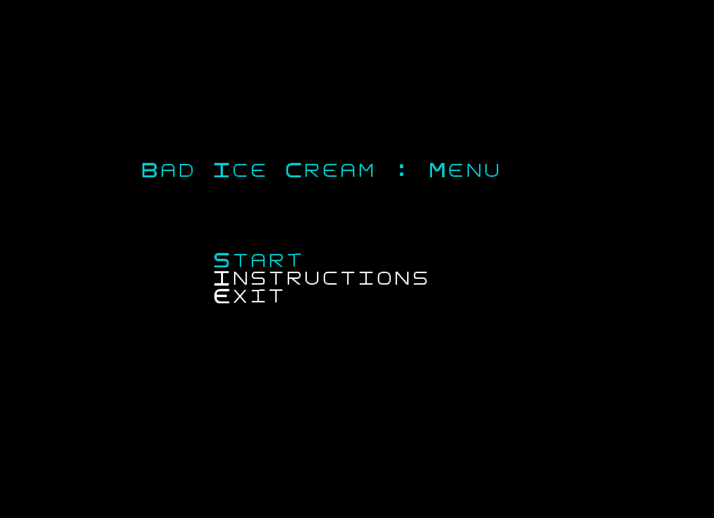

  
  <b><i>Fig 1. Main Menu </i></b>

 
 

  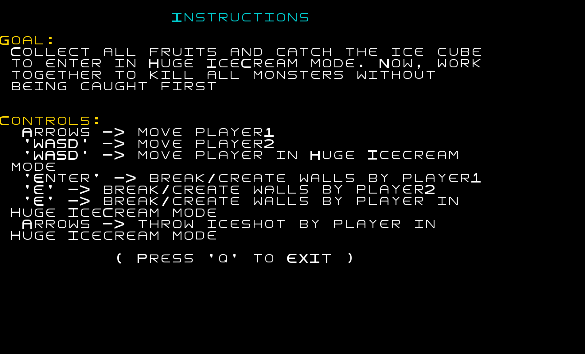

  
  <b><i>Fig 2. Instructions Menu </i></b>

 
 

  

  
  <b><i>Fig 3. Difficulty Menu </i></b>

 
 

  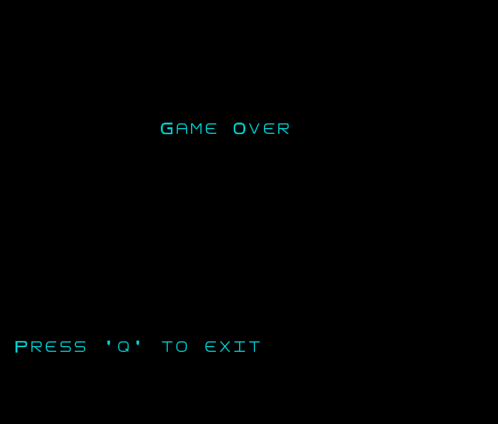

  
  <b><i>Fig 4. GameOver Menu </i></b>

 
 

  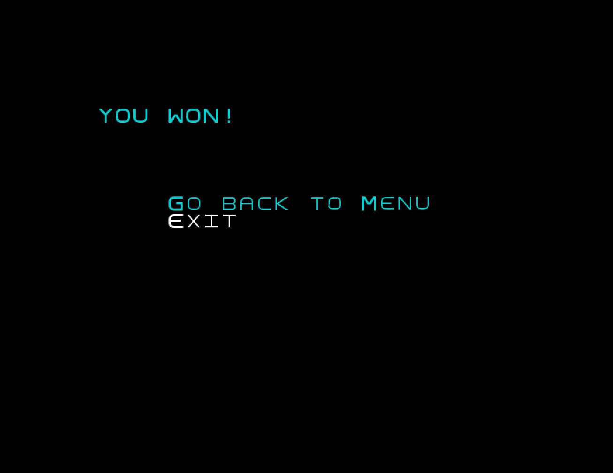

  
  <b><i>Fig 5. Win Menu </i></b>

 
 

## Game

  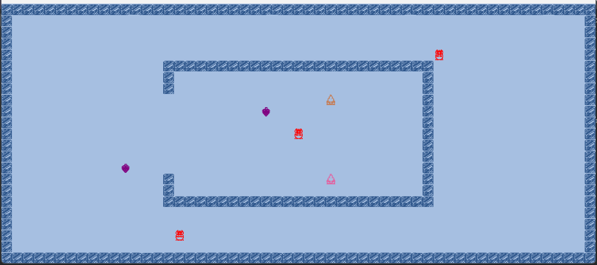

  
  <b><i>Fig 6. Easy Map </i></b>

 
 

  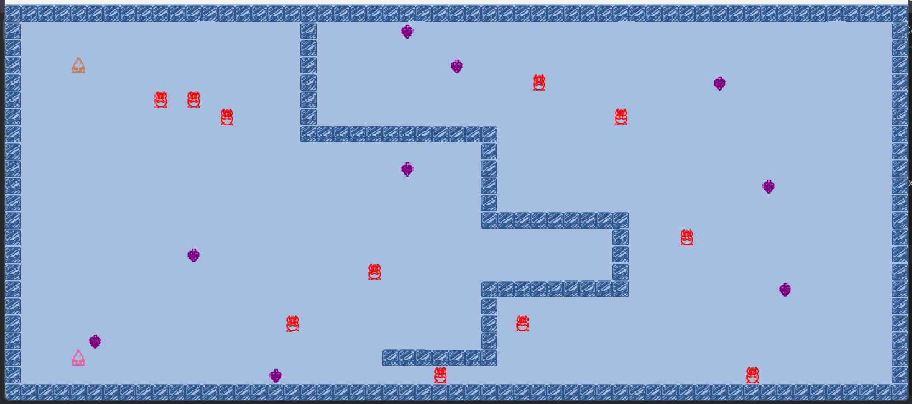

  
  <b><i>Fig 7. Medium Map </i></b>

 
 

  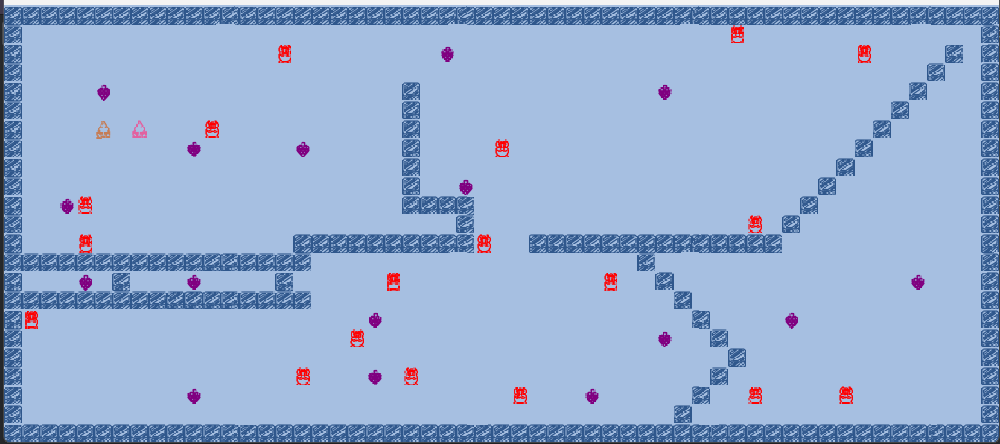

  
  <b><i>Fig 8. Hard Map </i></b>

 
 

  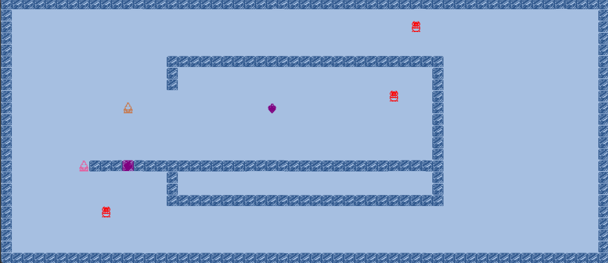

  
  <b><i>Fig 9. Fruit Behind Wall </i></b>

 
 

  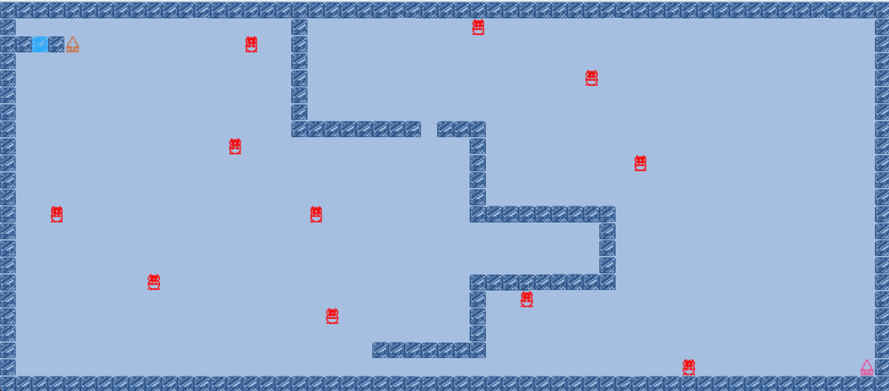

  
  <b><i>Fig 10. IceCube Behind Wall </i></b>

 
 

  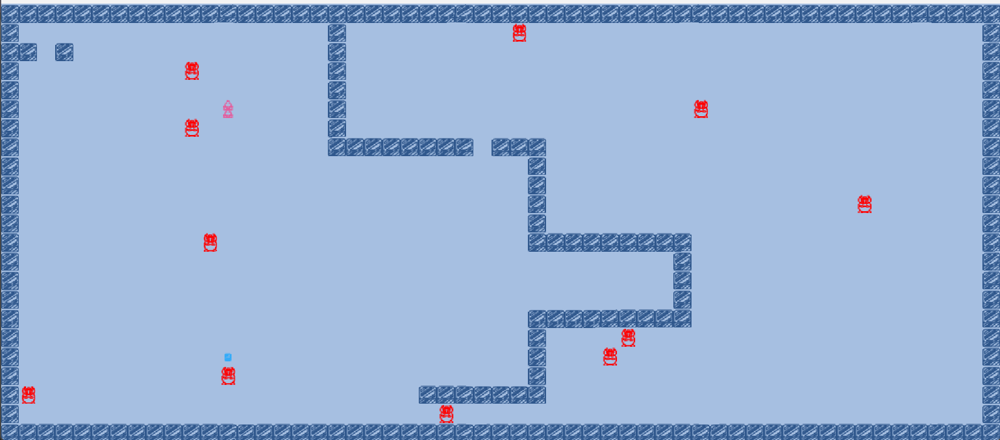

  
  <b><i>Fig 11. Throw IceShot </i></b>

 
 

## Mockups

  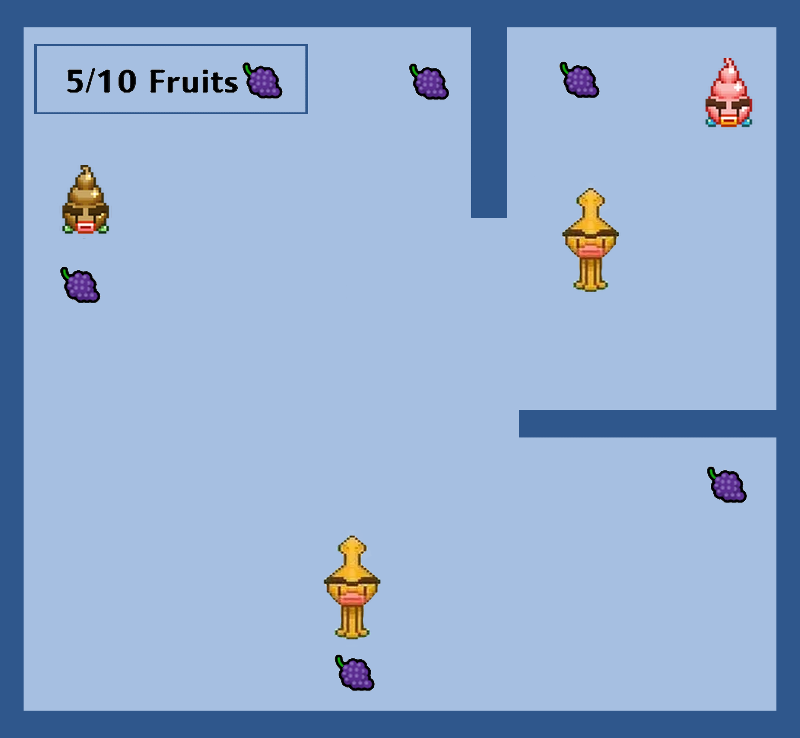

  
  <b><i>Fig 12. Players State </i></b>

 
 

  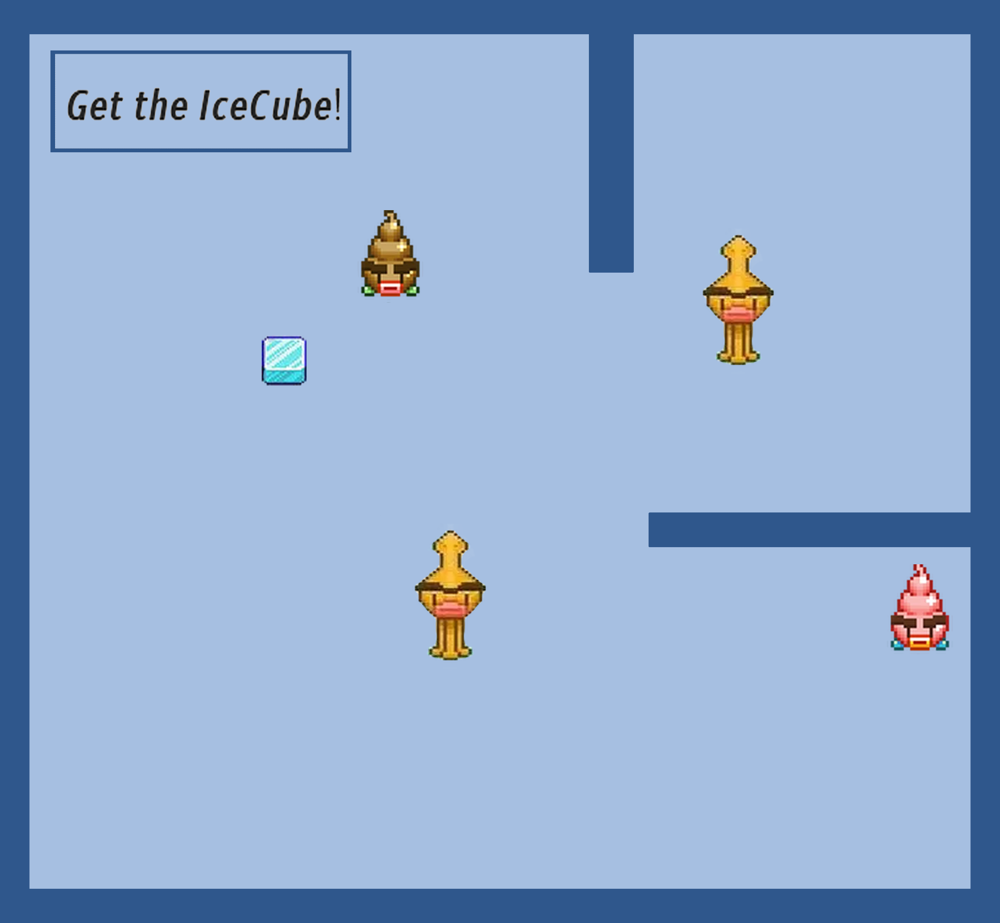

  
  <b><i>Fig 13. All fruits collected Sate </i></b>

 
 

  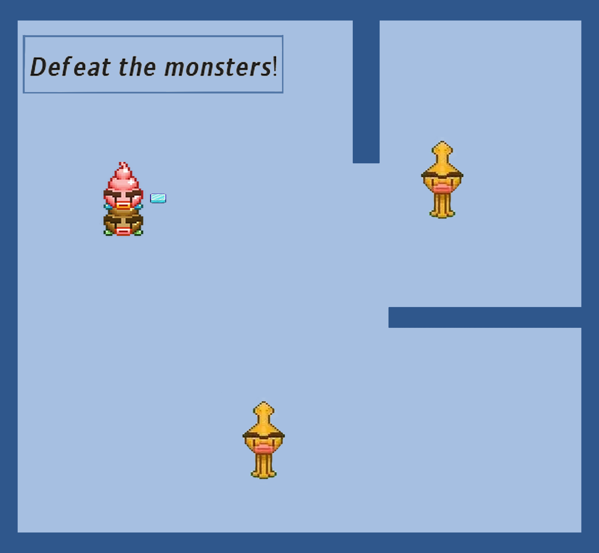

  
  <b><i>Fig 14. Huge Ice Cream State </i></b>

 
 
